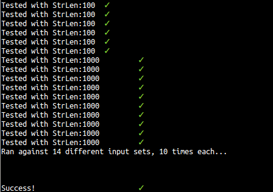

# Assignment-2 (30pts)
Use OpenMP to	implement	a	producer-consumer	algorithm.	

## Details
Assume	one	producer	and	one	consumer	and	a	buffer	queue	with	only	ONE	slot.	(Hint:	use	directives	such	as	
sections	and	critical).

# Usage

## Building
```bash
./build.sh
```

## Running
```bash
./pc_openmp.o
```

## Testing
Tests the program with a variety of inputs

```bash
python test.py
```




# Implementation
The implementation is simple thanks to OpenMP handling all the parallelization complexities. There is one producer and one consumer, each represented by a `parallel section`. An additional `critical section` guards the task queue ("queue", but it's really just a single character).
